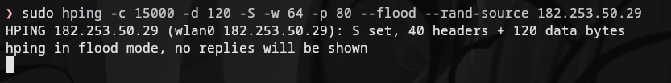
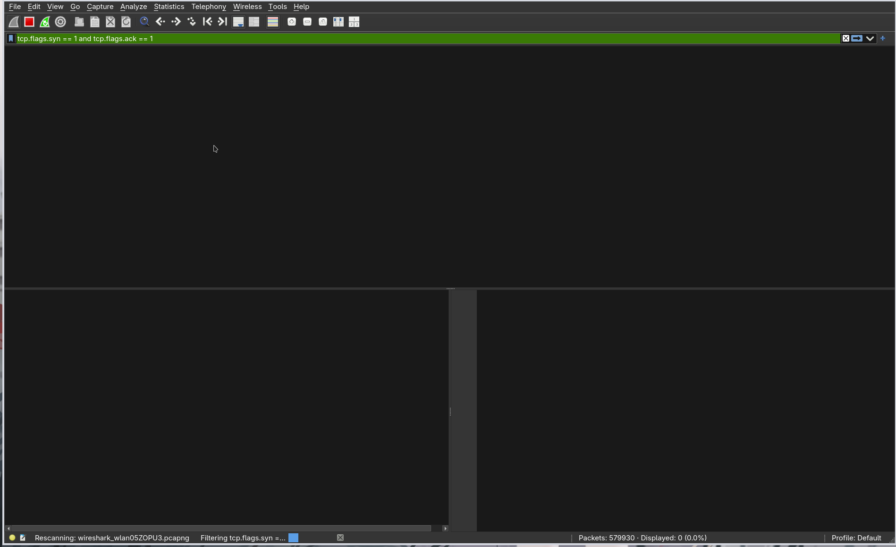
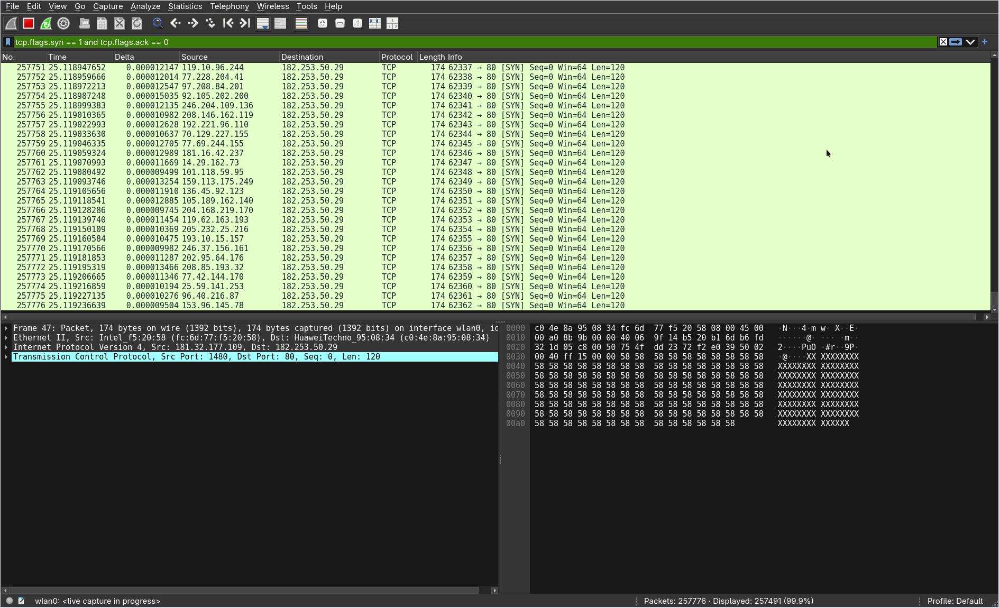
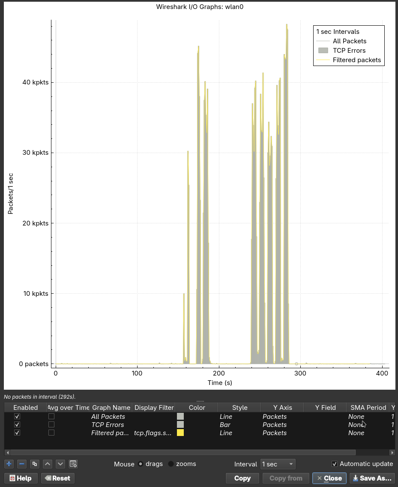
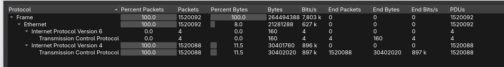

# TCP SYN Flood & Detection with Wireshark
> I Ketut Weda Adikusuma - 5027251061
--- 
## Apa itu three-way handshake?
three-way handshake adalah proses 3 langkah yang digunakan oleh protocol TCP untuk menentukan target transmisi data, mekanisme ini memastikan kedua end-point dari client dan server terhubung dan siap untuk bertukar data. 
Proses ini sangat penting untuk memastikan tingkat keandalan, konsistensi dan error control dari transmisi. Berbeda dengan UDP, TCP membutuhkan negosiasi koneksi yang terstruktur untuk tetap melakukan transmisi data. 
### Langkah-langkah
- SYN : Klien mengirim paket berlabel SYN ke server dan mencantumkan ISN atau Initial Sequence Number
- SYN - ACK : Server merespon dengan paket berlabel SYN dan ACK kembali ke klien, dan menggunakan ISN klien yang di increment 1x
- ACK : Klien mengirim kembali paket berlabel ACK dengan ISN nya server kembali ke server, setelah dikirim, status kedua device akan menjadi ESTABLISHED.
## SYN Flood
"attacker mengirim banyak SYN tanpa menyelesaikan handshake, sehingga menyebabkan half-open connections dan resource exhaustion."
Seperti yang dijelaskan, SYN Flood menggunakan three-way handshake untuk melakukan flooding pada paket berlabel SYN dari IP yang telah di _spoof_, sehingga receiver mengalami kesusahan untuk mereply SYN tersebut karena tidak menemukan IP yang dituju. server menunggu paket ACK terakhir, yang tidak pernah tiba, penyerang terus mengirim lebih banyak paket SYN. Kedatangan setiap paket SYN baru menyebabkan server untuk sementara mempertahankan koneksi port terbuka baru untuk jangka waktu tertentu, dan setelah semua port yang tersedia telah digunakan, server tidak dapat berfungsi secara normal.
## Pre-requisites
- Attacker: Kali Linux
- Victim: Windows atau Linux
- pastikan kedua device bisa saling berkomunikasi melalui jaringan.
## Simulasi serangan SYN flood
- Menjalankan serangan
    - Menggunakan hping3    
```bash
sudo hping3 -c 15000 -d 120 -S -w 64 -p 80 --flood --rand-source <IP-Victim>
```
    - Menggunakan nping
```bash
sudo nping --tcp -p 80 --flags SYN --data-length 120 --count 15000 --rate 100000 --interface en0 <IP-Victim>
```
 

## Capture & Analisis Trafik Wireshark
### Capturing
Filter untuk mengcapture SYN flood menggunakan Wireshark ada 2 yakni:
1. filter untuk melihat SYN tanpa ACK:
```txt 
tcp.flags.syn == 1 and tcp.flags.ack == 0
```
 
2. filter untuk melihat SYN/ACK:
```txt
tcp.flags.syn == 1 and tcp.flags.ack == 1
```
 
### Statistics
1. Spike Trafik melalui I/O graph:

2. Membandingkan volume paket menggunakan Protocol Hierarchy:
 
## Diskusi & Interpretasi
> Apa gejala khas serangan SYN Flood berdasarkan hasil capture?
- Sumber random yang banyak dengan 1 destinasi.
- Dikirim dengan sangat cepat.
- Port Destination, Ukuran TCP window, ukuran payload nya constan.
- Delta relatif sangat kecil.
- Saat diserang trafik dan volume paket mengalami spike yang sangat besar.
> Mengapa jumlah SYN-ACK tetap sedikit meskipun jumlah SYN sangat banyak?

Kedatangan setiap paket SYN baru menyebabkan server untuk sementara mempertahankan koneksi port terbuka baru untuk jangka waktu tertentu,
ini terjadi melalui IP spoofing, dimana korban tidak dapat mengirim SYN/ACK kembali ke IP yang dituju(karena tidak ada). [Source](https://www.firewall.cx/tools-tips-reviews/network-protocol-analyzers/performing-tcp-syn-flood-attack-and-detecting-it-with-wireshark.html)

>Apa dampak penggunaan IP spoofing terhadap proses deteksi dan mitigasi?
- Menyulitkan identifikasi penyerang asli.
- Mitigasi salah memblokir access IP dari pengguna yang sah.

## Refleksi & Perlindungan
>Refleksi singkat: bagaimana SYN Flood berdampak pada jaringan, dan bagaimana cara mendeteksinya.

SYN flood memperlambat jaringan atau bisa dibilang mengalami DoS(Denial of Service) yang menyebabkan server tidak bekerja dengan normal/sangat lambat.

Untuk mendeteksi sebuah SYN flood kita bisa menggunakan Wireshark dan melihat ciri-ciri khas yang telah di diskusikan tadi untuk mengetahui apakah kita sedang diserang.
>Diskusikan teknik mitigasi umum: SYN cookies, backlog tuning, filtering, firewall/proxy, dan sebagainya.

- meningkatkan Backlog queue

Setiap sistem operasi pada perangkat yang ditargetkan memiliki sejumlah koneksi setengah terbuka yang memungkinkannya. Salah satu respons terhadap paket SYN bervolume tinggi adalah dengan meningkatkan jumlah maksimum kemungkinan koneksi setengah terbuka yang dimungkinkan oleh sistem operasi. Agar berhasil meningkatkan simpanan maksimum, sistem harus mencadangkan sumber daya memori tambahan untuk menangani semua permintaan baru. Jika sistem tidak memiliki memori yang cukup untuk dapat menangani peningkatan ukuran antrian backlog, kinerja sistem akan terkena dampak negatif, namun hal ini mungkin lebih baik daripada penolakan layanan.
- Recycling the Oldest Half-Open TCP connection

Strategi mitigasi lainnya melibatkan penimpaan koneksi setengah terbuka tertua setelah simpanan terisi. Strategi ini mengharuskan koneksi yang sah dapat dibuat sepenuhnya dalam waktu yang lebih singkat dibandingkan backlog yang dapat diisi dengan paket SYN berbahaya. Pertahanan khusus ini gagal ketika volume serangan ditingkatkan, atau jika ukuran simpanan terlalu kecil untuk praktis.
- SYN cookies

Strategi ini melibatkan pembuatan cookie oleh server. Untuk menghindari risiko putusnya koneksi ketika backlog telah terisi, server merespons setiap permintaan koneksi dengan paket SYN-ACK tetapi kemudian menghapus permintaan SYN dari backlog, menghapus permintaan dari memori dan membiarkan port terbuka dan siap membuat koneksi baru. Jika koneksi adalah permintaan yang sah, dan paket ACK akhir dikirim dari mesin klien kembali ke server, server kemudian akan merekonstruksi (dengan beberapa batasan) entri antrian backlog SYN. Sementara upaya mitigasi ini memang kehilangan beberapa informasi tentang koneksi TCP, itu lebih baik daripada membiarkan penolakan-layanan terjadi pada pengguna yang sah sebagai akibat dari serangan.
- Konfigurasi Firewall untuk SYN Attack Treshold dan Perlindungan SYN Flood

Firewall dapat dikonfigurasi untuk membatasi lalu lintas masuk dan memblokir koneksi dari alamat IP berbahaya yang mencurigakan atau diketahui. Mereka juga dapat diatur untuk mengurangi batas waktu untuk koneksi setengah terbuka, yang dapat membantu mengurangi dampak serangan SYN Flood.
- Menginstal Intrusion Prevention System (IPS)

Sebuah IPS dapat mendeteksi pola lalu lintas anomali dan memblokir paket berbahaya1. Ini garis pertahanan pertama Anda melawan serangan SYN Flood. Misalnya, jika IPS mendeteksi lonjakan permintaan SYN secara tiba-tiba dari satu alamat IP, hal ini dapat mengindikasikan serangan SYN Flood dan IPS dapat memblokir permintaan lebih lanjut dari alamat IP tersebut.
- Memasang Peralatan Jaringan Terkini dengan Kemampuan Rate-Limiting

Peralatan jaringan modern sering kali dilengkapi dengan kemampuan pembatas kecepatan bawaan. Hal ini dapat membantu mencegah serangan SYN Flood dengan membatasi jumlah permintaan SYN yang akan diterima server dari satu alamat IP dalam jangka waktu tertentu.
## Source
1. [SYN Flooding Tutorial](https://www.firewall.cx/tools-tips-reviews/network-protocol-analyzers/performing-tcp-syn-flood-attack-and-detecting-it-with-wireshark.html)
2. [Three-way Handshake](https://www.geeksforgeeks.org/computer-networks/tcp-3-way-handshake-process/)
3. [SYN Flood DDos Attack](https://www.cloudflare.com/learning/ddos/syn-flood-ddos-attack/)
4. Classroom MyITS
